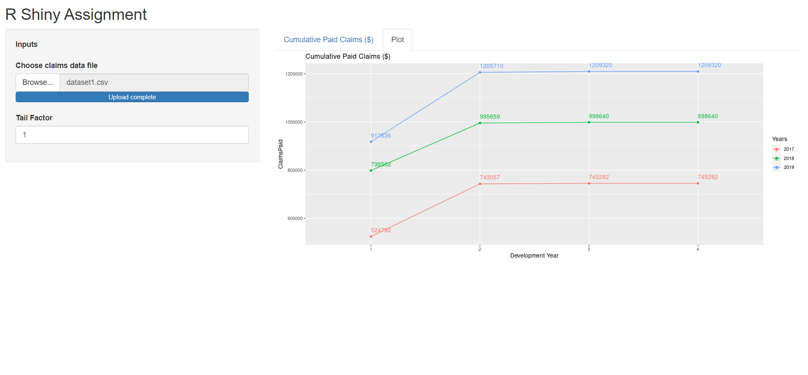
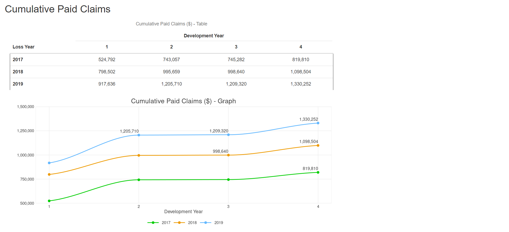
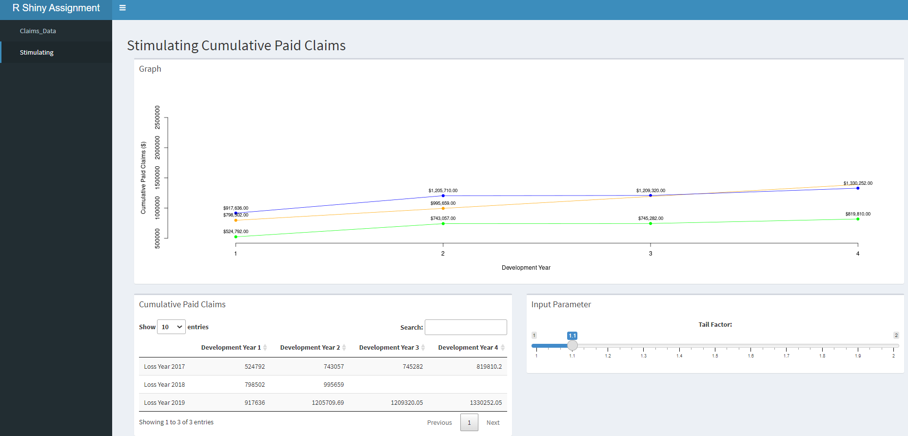

# An introduction to R Shiny

## Prerequisite

1. R programming
2. RStudio or Visual Studio Code

## What you need to learn

1. Use R Shiny to create web applications
2. Create R packages, including unit tests, documentation, version control, etc
3. DevOps skills, eg *CI/CD using Github Action, deployment

*CI/CD = Continuous Integration or Continuous Delivery

## R Style Guide

Although we assumed you were already familiar with R programming, however, even expert programmers will have their own preferred code styles. To improve our coding experience, we strongly encourage you to follow the [tidyverse style guide](https://style.tidyverse.org/index.html)

## Shiny

### Interactive course

1. https://rstudio-education.github.io/shiny-course/

### Video

1. https://shiny.rstudio.com/tutorial/

### Book

1. https://mastering-shiny.org/ 🌟
2. https://engineering-shiny.org/ **(Optional)**

### Articles

1. https://shiny.rstudio.com/articles/

### Awesome Shiny Extension (Optional)

1. https://github.com/nanxstats/awesome-shiny-extensions

## R Packages

1. https://r-pkgs.org/ 🌟

## Github for R

1. https://happygitwithr.com/ 🌟

## shinyapps.io

1. https://shiny.rstudio.com/articles/shinyapps.html 🌟
2. https://docs.rstudio.com/shinyapps.io/

*Note: All materials with 🌟 behind are recommended to study*

## Recommended way to learn

There is no best way to learn things. We usually learn by googling what we need and finding answers on StackOverflow or other sites

But here is the sequence you may consider to follow:

1. Choose one of the following: [interactive course](https://rstudio-education.github.io/shiny-course/), [video](https://shiny.rstudio.com/tutorial/) or [Mastering Shiny book](https://mastering-shiny.org/), then go through it
2. If you choose interactive course or video, you should go through [Mastering Shiny: Best practices](https://mastering-shiny.org/scaling-intro.html)
3. Then, you should refers to corresponding chapters in [Happy Git and GitHub for the useR](https://happygitwithr.com/) when needed, eg *'Connect Git, GitHub, RStudio'* when configuring Git in RStudio or *'Early GitHub Wins'* for R project setup
4. After that, learn to wrap Shiny app into R package, you may read [Mastering Shiny: Packages](https://mastering-shiny.org/scaling-packaging.html) & [R Packages: The whole game](https://r-pkgs.org/whole-game.html), and only read individual chapters when needed
5. Lastly, go through [Shiny articles: Deployment](https://shiny.rstudio.com/articles/shinyapps.html), and try to deploy the app to [shinyapps.io](https://www.shinyapps.io/) 

## Assessment (a.k.a Time to show your skills)

*Note: I recommend starting with the assessment and learning while doing it if you are too bored to go through all the materials*

Learning is mostly about practicing

> “Practice makes perfect. After a long time of practicing, our work will become natural, skillful, swift, and steady.” ― Bruce Lee

But,

> “Practice does not make perfect. Only **perfect practice** makes perfect.” ― Vince Lombardi

Now, you are required to create a Shiny app based on [this Excel spreadsheet](https://github.com/n-actuarial/r-shiny-intro/blob/main/R%20Shiny%20Assignment.xlsx) (refers inside for **inputs, outputs & some other labels**)

To pass this assessment, you need to fulfill this list of requirements :upside_down_face:

1. Create a working Shiny app that reproduces the correct results as in the Excel spreadsheet
2. Create a public repo at your own GitHub account
3. Commit & push your Shiny app and/or code changes to GitHub
4. Deploy it to shinyapps.io or other hosting providers
5. Wrap the whole Shiny app into an R package **(Optional)**
6. Use GitHub Action for CI/CD **(Optional)**

## Sample Apps

*Sample App 1*

*Sample App 2*

*Sample App 3*

## Further Study

Technically, Shiny is a web application framework that translates R code to HTML. Therefore, it can work seamlessly with other web frameworks, and adding HTML, CSS & JS knowledge will definitely prove helpful when building advanced web applications

1. https://github.com/microsoft/Web-Dev-For-Beginners
